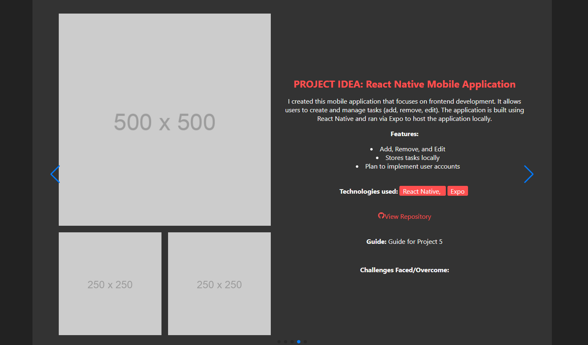

# INF655 Final Project

# Antonio's Portfolio Website

## Description
This project is my personal portfolio website developed using ReactJS. The website showcases my skills, projects, and provides users a way to contact me. The website also includes an authentication feature that allows users to create an account/login/logout. 

## Purpose
The purpose of this project is to provide an online presense for myself. Allowing me to showcase my skills and projects to potential employers. While making it easy for anyone to find and contact me.

## Features:
- Home page: Provides a brief introduction to myself and my skills.
- About: Provides a more detailed description of myself and experience.
- Projects: Showcases my projects and provides links to their GitHub repositories.
- Contact: Provides a form for users to contact me.
- Authentication: Allows users to create an account/login/logout.

|  |  |
|:---:|:---:|
|  |  |

## How to Use (when deployed):
Simply navigate the different sections of the website by scrolling or using the navigation bar. To contact me, fill out the form on the contact page. 

## Dependencies:
1. ReactJS
2. Firebase
3. React Router -dom
4. Bootstrap-

This project was bootstrapped with [Create React App](https://github.com/facebook/create-react-app).

How to run this project:
1. Clone this repository
2. Run `npm install` to install all dependencies(packages)
3. Create a `.env` file in the root directory and add your Firebase configuaration
4. Run `npm start` to start the application

|  |  |

## Progress Checklist:
- [x] Project Idea
    - [x] Project Proposal
- [x] Create React App and setup Project
- [x] Setup development environment
- [x] Build application(basic structure)
    - [x] Sections completed: Home, About, Projects, Contact
    - [x] Components, routes, navigation, etc.
    - [ ] Blog and comments section
- [x] Setup Firebase authentication
    - [x] Create Firebase project
    - [x] Setup Firebase authentication
    - [ ] 
- [x] Setup Firestore database
    - [x] Create Firestore database
    - [x] Setup Firestore database
    - [ ] All functionality
- [x] Test application and improve functionality and UI
    - [x] Test application
    - [x] Improve functionality and UI
    - [ ] Included 
- [ ] Deploy application
- [ ] Include full updated information, images, and links (personal)
- [ ] Additional features from proposal

## Future Enchancements: 
1. Add a blog section
2. Add a comments section
3. Add a resume section
4. Admin Dashboard
5. Testimonials
6. Demos of projects
7. Interactive UI
8. Overall performance, security, and accessibility improvements
